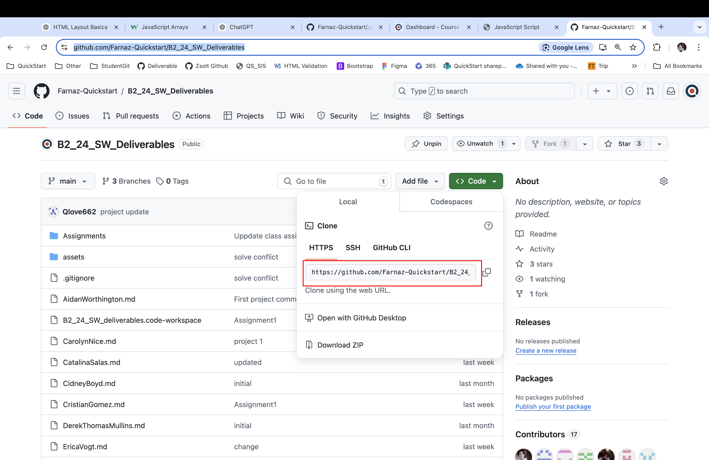
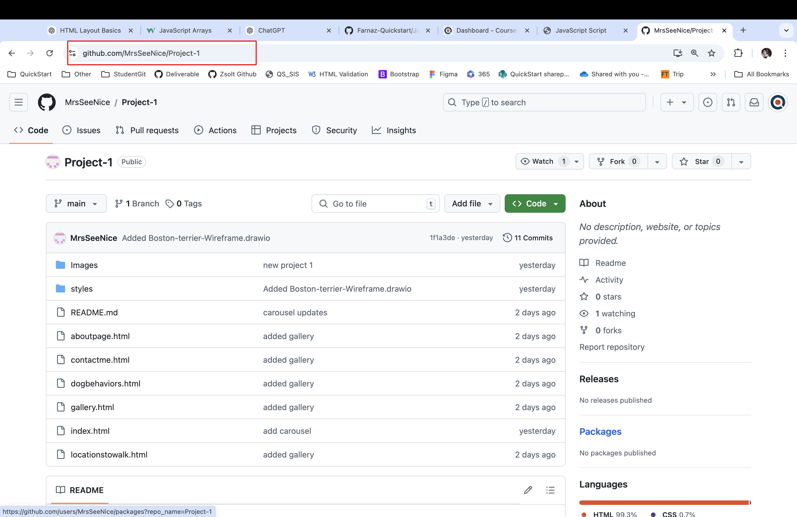

<br>

# QuickStart Software 24 Deliverables

Welcome to the QuickStart Software 24 student homework repository.
This is the place that we are going to monitor the completion of your deliverables and projects. Please update your assignment and project links as we going through the process.


## Step-by-Step Guide to Adding Your Deliverable Link
### 1. Clone the Project Repository
Navigate to your workspace on your local machine.
```
git clone https://github.com/Farnaz-Quickstart/B2_24_SW_Deliverables
``` 
This will create a local copy of the project on your system.

<br>

### 2.Navigate to Your Assigned File
- Open your terminal or file explorer and navigate to the folder containing the cloned project.
- Inside the project directory, locate your assigned .md file (Markdown file) for submitting your deliverable.


### 3. Add Your Project Link
- Open your .md file in Visual Studio Code.
- Copy the URL of your assignment or project GitHub repository link.
- Paste the URL in the appropriate section of your .md file, where your name or ID is listed.

<br>

### 4.Example of Adding a Link
Here is an example of how your file should look after adding the link:

```
**Project 1:** [https://github.com/ErikaV2291/Project_1]
```
### 5. Save and Commit Your Changes
After adding your link, save the file.

Commit the changes with a meaningful message:

```
git add .
git commit -m "Added project deliverable link"
```

### 6. Push Changes to the Repository
Push the changes to the remote repository:

```
Copy code
git push origin main
```


